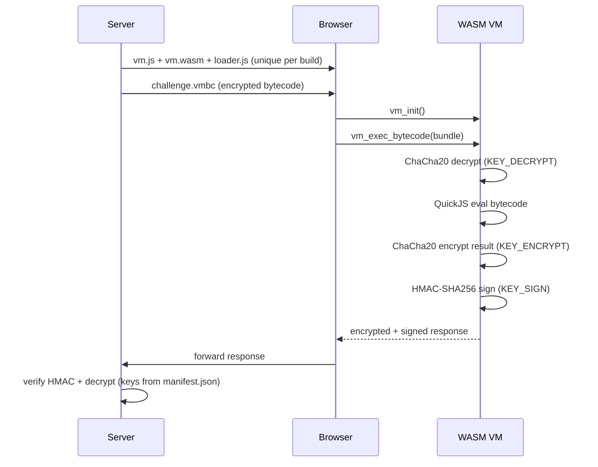
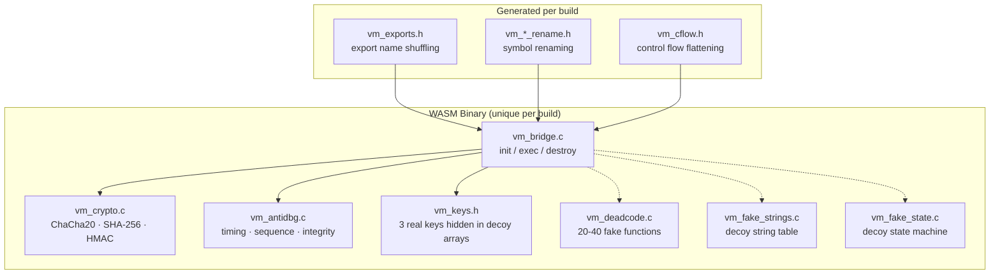

# quickjs-wasm

Polymorphic QuickJS WASM virtual machine. Executes encrypted JavaScript bytecode in a sandboxed, anti-debug environment. Responses are encrypted and signed. Every build produces a unique binary.

## How It Works



## VM Architecture



## Three Embedded Keys

Baked into each WASM binary at compile time, hidden at random offsets inside decoy byte arrays:

| Key              | Purpose                                    |
| ---------------- | ------------------------------------------ |
| `VM_KEY_DECRYPT` | ChaCha20-decrypts incoming `.vmbc` bundles |
| `VM_KEY_ENCRYPT` | ChaCha20-encrypts JS execution results     |
| `VM_KEY_SIGN`    | HMAC-SHA256 signs encrypted responses      |

The server receives `build/manifest.json` with matching keys for verification.

## Wire Formats

**Bytecode bundle** (`.vmbc`):

```
┌──────────┬──────────────┬──────────┬────────────┐
│ 4B magic │ 4B bc_len LE │ 12B nonce│ ciphertext │
│ "VMBC"   │              │          │            │
└──────────┴──────────────┴──────────┴────────────┘
```

**Response**:

```
┌──────────┬───────────────┬───────────┬────────────┬──────────┐
│ 4B magic │ 4B total_len  │ 12B nonce │ ciphertext │ 32B HMAC │
│ "VMRP"   │ LE            │           │            │          │
└──────────┴───────────────┴───────────┴────────────┴──────────┘
```

## Polymorphic Builds

Each `node scripts/build.js` invocation produces a structurally unique binary:

- **New keys** — fresh 32-byte random key material
- **Randomized memory layout** — 3 real + 1 trap + 3 decoy keys shuffled across variable-size arrays (384-1024B) with double-indirection macros
- **Dead code injection** — 20-40 functions with realistic bodies, fake string tables, fake state machines
- **Full symbol renaming** — all exports and internal symbols renamed via `-include` headers with random prefixes
- **Control flow obfuscation** — dispatch macros, opaque predicates via volatile globals
- **Build entropy** — random `BUILD_SEED` + `BUILD_ENTROPY_*` defines alter compilation

## Anti-Debug

The VM gates every execution through `antidbg_check()`:

- **Call sequence** — must init before exec
- **Execution counter** — capped at 64 per session
- **Timing anomaly** — >120s between execs triggers failure
- **Integrity hashing** — FNV-1a accumulator over internal state
- **Poison latch** — once tripped, VM permanently refuses execution
- **Symbol obfuscation** — all names randomized per build

JS introspection: `__vm_ts()`, `__vm_integrity()`, `__vm_check()`.

## Project Structure

```
src/
  vm_bridge.c          Entry points: init, destroy, exec, free
  vm_crypto.c/h        ChaCha20, SHA-256, HMAC-SHA256
  vm_antidbg.c/h       Timing, call sequence, integrity
scripts/
  build.js             Polymorphic build orchestrator
  compile.js           JS → encrypted .vmbc bundles
build/                 (generated per build)
  manifest.json        Keys + export map (server-side)
web/
  index.html           Test page
  hello.js             Minimal test bytecode source
  loader.js            (generated) Build-matched WASM loader
  vm.js/vm.wasm        (generated) Emscripten output
```

## Prerequisites

- [Emscripten SDK](https://emscripten.org/docs/getting_started/downloads.html)
- Node.js 18+
- QuickJS source (`git submodule update --init`)

## Usage

```bash
git submodule update --init

source /path/to/emsdk/emsdk_env.sh

# Build (polymorphic — each run produces unique output)
node scripts/build.js

# Compile JS to encrypted bytecode
node scripts/compile.js challenge.js
node scripts/compile.js challenge.js --key <hex>

# Test
node scripts/compile.js web/hello.js --out web/test.vmbc
# Open web/index.html
```

### Output

| File                        | Purpose                              |
| --------------------------- | ------------------------------------ |
| `web/vm.js` + `web/vm.wasm` | Emscripten WASM module               |
| `web/loader.js`             | Build-matched JS loader              |
| `build/manifest.json`       | Keys + export map (keep server-side) |
| `build/*.vmbc`              | Encrypted bytecode bundles           |

## Formatting

```bash
npx prtfm
clang-format -i src/*.c src/*.h
```

## License

[MIT](LICENSE)
